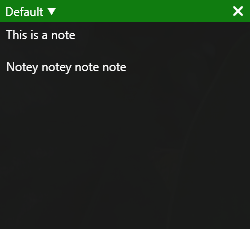

# AlwaysNote

**AlwaysNote** is a Windows application that provides a multi-note notepad that can be shown using Win + Ctrl + A.

The notepad appears over all other apps, making it perfect for taking notes while using a full screen application.

## Screenshot

## Building

Building AlwaysNote requires Visual Studio with .NET and NSIS. When the project a built, an NSIS installer is automatically created.
